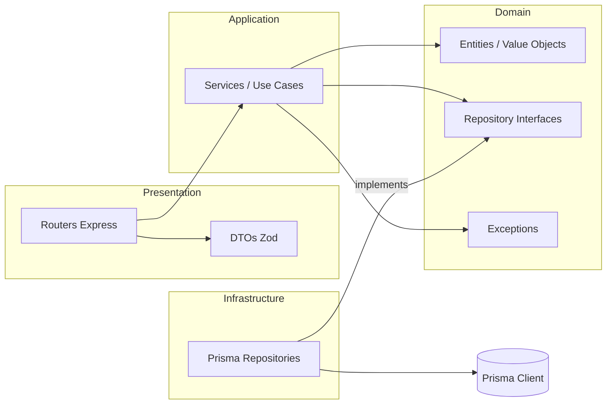
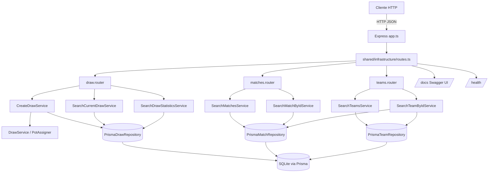
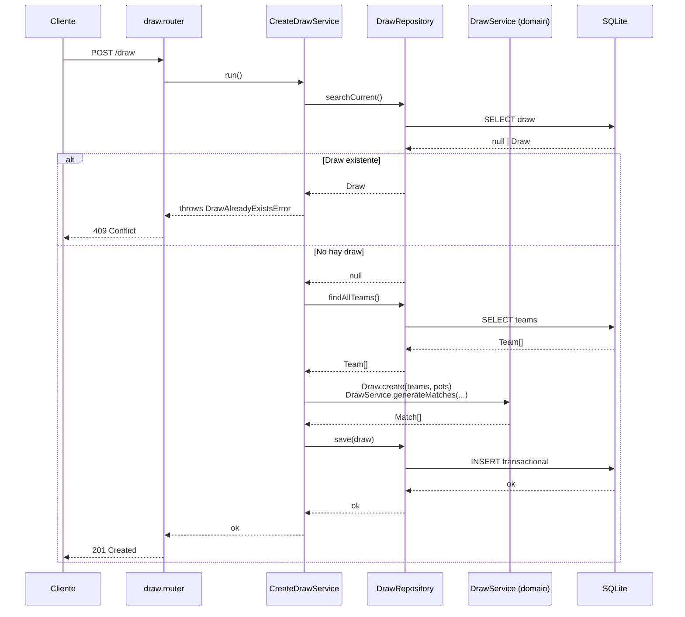
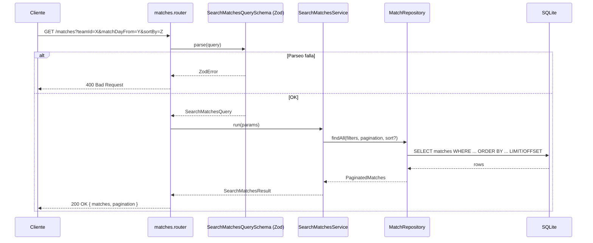
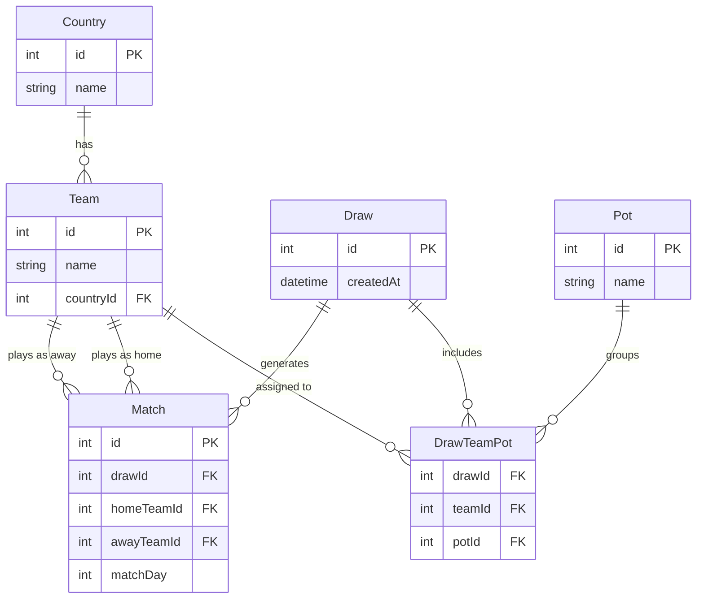

# Architecture

## Stack

- **Runtime**: Node.js ≥ 22, TypeScript
- **Framework HTTP**: Express 4
- **ORM**: Prisma 7 + `@prisma/adapter-better-sqlite3`
- **DB**: SQLite (dev) — fácilmente reemplazable por Postgres vía el adapter correspondiente
- **DI**: InversifyJS
- **Validación**: Zod (capa de presentación)
- **Tests**: Vitest (unit), Mocha + chai-http (integración)
- **Docs**: OpenAPI 3.0.3 (`docs/openapi.yaml`) servido con Swagger UI en `/docs`

## Organización por Bounded Contexts (DDD-lite)

Cada dominio vive en `src/contexts/<context>/` y respeta el layering clásico:

```
domain/           <- entidades, value objects, repositorios (interfaces) y excepciones
application/      <- casos de uso / servicios de aplicación (puros, sin I/O)
infrastructure/   <- adaptadores (Prisma, seeds)
presentation/     <- routers Express + DTOs Zod
```

Los contextos actuales son:

- **draw** — crear/consultar/eliminar el sorteo, estadísticas.
- **matches** — búsqueda y detalle de partidos.
- **teams** — listado y detalle de equipos.

Los componentes transversales están en `src/shared/`:
- `container/` — contenedor Inversify y tokens.
- `infrastructure/` — inicialización de Prisma, registro de rutas, base `PrismaRepository`.
- `domain/` — primitivas compartidas (`AggregateRoot`, `ValueObject`).

## Dependencias entre capas



Reglas:

- **Domain** no depende de nada externo. Sólo TypeScript puro.
- **Application** depende de interfaces del dominio — nunca de Prisma ni Express.
- **Infrastructure** implementa interfaces del dominio (adapter pattern).
- **Presentation** convierte HTTP ↔ comandos/queries de aplicación. Usa Zod para validar input y mapea errores a status HTTP.

El acoplamiento a Prisma queda aislado en `*/infrastructure/prisma-*.repository.ts`. Swappear la DB es cambiar el adapter de Prisma y, si fuera necesario, rehacer las implementaciones de repositorio.

## Diagrama de componentes



## Flujo: POST /draw



## Flujo: GET /matches (con filtros y ordenamiento)



## Modelo de datos



## Decisiones de diseño relevantes

- **Aggregate boundary en `Draw`**: `Draw` es el root agregado para el sorteo. `Match` vive dentro del sorteo desde el punto de vista de escritura; desde el punto de vista de lectura tiene su propio `MatchEntity` en el contexto `matches` (CQRS-lite: escritura y lectura optimizadas por contexto).
- **Teams como contexto propio**: aunque `draw/domain/team.ts` ya tiene un `Team` (value object interno al sorteo), se creó un `teams` context separado con su propia `TeamEntity`/repo para exponer el endpoint público `GET /teams`. Evita acoplar el dominio público de equipos al dominio interno del sorteo.
- **Validación en dos capas**: Zod en presentación (input HTTP) + guards en los services (invariantes de negocio: `page >= 1`, `id positivo`, etc).
- **Manejo de errores**: excepciones tipadas (`DrawAlreadyExistsError`, `MatchNotFoundError`, `TeamNotFoundError`) traducidas a status HTTP en los routers. No se expone la stack ni el tipo al cliente.
- **DI con Inversify**: facilita testear con mocks (los unit tests instancian el servicio con repos falsos) y permite agregar servicios sin modificar el sitio de uso.
- **Prisma con adapter SQLite**: `better-sqlite3` para dev; cambiar a Postgres es cambiar el adapter en `prisma/lib/prisma.ts` + proveer `DATABASE_URL`.

## Extensibilidad

Agregar un contexto nuevo (p. ej. `coaches`) requiere:

1. Crear `src/contexts/coaches/{domain,application,infrastructure,presentation}/`.
2. Registrar bindings en `src/shared/container/container.ts` + `types.ts`.
3. Registrar router en `src/shared/infrastructure/routes.ts`.
4. Documentar los endpoints en `docs/openapi.yaml`.

Nada en los demás contextos necesita cambiar.
